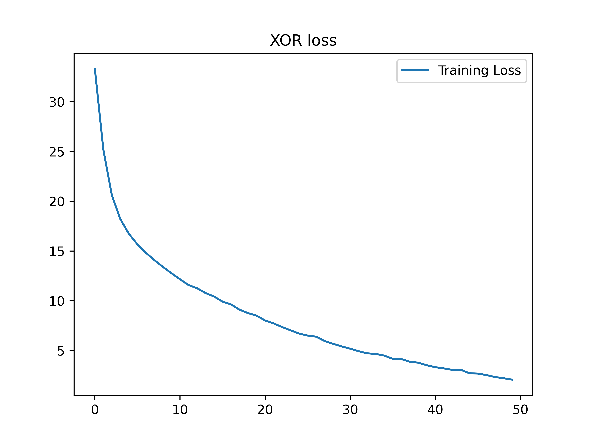


# DNN-XOR

通过前馈神经网络，构建XOR函数模型。使用[Lumos]([LumosNet (github.com)](https://github.com/LumosNet))深度学习框架，实现神经网络构建，训练和测试

## 异或（XOR）

异或函数XOR，是两个二进制数a，b的运算，当且仅当其中一个值为1时，XOR结果为1，其余结果为0

**异或**

| 标签 | 数据  [a, b]     |
| ---- | ---------------- |
| 1    | [1, 0]    [0, 1] |
| 0    | [1, 1]    [0, 0] |

异或问题是典型的非线性问题，与逻辑与，逻辑或相比较

**逻辑与**

| 标签 | 数据  [a, b]               |
| ---- | -------------------------- |
| 1    | [1, 1]                     |
| 0    | [1, 0]    [0, 1]    [0, 0] |

**逻辑或**

| 标签 | 数据  [a, b]               |
| ---- | -------------------------- |
| 1    | [1, 0]    [0, 1]    [1, 1] |
| 0    | [0, 0]                     |

异或，逻辑与，逻辑或的散点图如下


可以看出，逻辑与和逻辑或的数据分布可以用一个线性函数进行分割，而异或无法用单一线性函数进行划分，所以XOR函数是一个典型的非线性函数


## 模型构建

### 数据集


数据集下载[XOR](https://mypikpak.com/s/VOFBhD0Qdyn9qZO5hxPCdTx6o1)

将异或的四个数据作为训练和测试数据，我们希望构建的模型能够完全拟合

| 数据   | 标签 |
| ------ | ---- |
| [0, 0] | 0    |
| [0, 1] | 1    |
| [1, 0] | 1    |
| [1, 1] | 0    |


### 网络结构

```
[Lumos]         Module Structure
Im2col          Layer
Connect         Layer    :    [output=   4, bias=1, active=relu]
Connect         Layer    :    [output=   2, bias=1, active=relu]
Mse             Layer    :    [output=   1]

[Lumos]                     Inputs         Outputs
Im2col          Layer      2*  1*  1 ==>   1*  1*  2
Connect         Layer      1*  1*  2 ==>   1*  1*  4
Connect         Layer      1*  1*  4 ==>   1*  1*  2
Mse             Layer      1*  1*  2 ==>   1*  1*  1
```

一共两层全连接层，神经元个数分别为4，2

全连接层带有偏置项，采用relu激活函数

损失函数采用Mse（均方差）
$$
MSE=\frac{1}{n}SSE=\frac{1}{n} \sum_{i=1}^{n}(\hat{y_{i}}-y_i)^{2} \\
\hat{y_{i}}预测结果，y_i 真实标签
$$


## 代码构建

### 网络构建

首先创建graph，并将所有layer添加至graph中

lumos接受数据必须是图片形式，所以添加im2col层将图像数据转化为一维向量

```c
Graph *g = create_graph();
Layer *l1 = make_im2col_layer();
Layer *l2 = make_connect_layer(4, 1, "relu");
Layer *l3 = make_connect_layer(2, 1, "relu");
Layer *l4 = make_mse_layer(2);
append_layer2grpah(g, l1);
append_layer2grpah(g, l2);
append_layer2grpah(g, l3);
append_layer2grpah(g, l4);
```


### 权重初始化器

Lumos框架默认采用KaimingHe初始化


### 创建会话

创建会话，设置输入数据大小和标签数据规模，指定训练模式（CPU or GPU）和预训练权重

```c
Session *sess = create_session(g, 1, 2, 1, 2, type, path);
```


### 创建训练场景

指定训练数据，训练batch设置为2，训练50轮，学习率 0.1

设置训练数据目录列表和标签数据目录列表

```c
set_train_params(sess, 50, 2, 2, 0.1);
init_session(sess, "./data/xor/data.txt", "./data/xor/label.txt");
```


### 创建测试会话和场景

```c
Session *t_sess = create_session("cpu", init);
bind_graph(t_sess, graph);
create_test_scene(t_sess, 1, 2, 1, 1, 1, xor_label2truth, "./xor/test.txt", 		                       "./xor/label.txt");
init_test_scene(t_sess, "./xorw.w");
session_test(t_sess, xor_process_test_information);
```


### 完整代码

```c
#include <stdio.h>
#include <stdlib.h>

#include "lumos.h"

void xor(char *type, char *path)
{
    Graph *g = create_graph();
    Layer *l1 = make_im2col_layer();
    Layer *l2 = make_connect_layer(4, 1, "relu");
    Layer *l3 = make_connect_layer(2, 1, "relu");
    Layer *l4 = make_mse_layer(2);
    append_layer2grpah(g, l1);
    append_layer2grpah(g, l2);
    append_layer2grpah(g, l3);
    append_layer2grpah(g, l4);
    Session *sess = create_session(g, 1, 2, 1, 2, type, path);
    set_train_params(sess, 50, 2, 2, 0.1);
    init_session(sess, "./data/xor/data.txt", "./data/xor/label.txt");
    train(sess);
}

void xor_detect(char *type, char *path)
{
    Graph *g = create_graph();
    Layer *l1 = make_im2col_layer();
    Layer *l2 = make_connect_layer(4, 1, "relu");
    Layer *l3 = make_connect_layer(2, 1, "relu");
    Layer *l4 = make_mse_layer(2);
    append_layer2grpah(g, l1);
    append_layer2grpah(g, l2);
    append_layer2grpah(g, l3);
    append_layer2grpah(g, l4);
    Session *sess = create_session(g, 1, 2, 1, 2, type, path);
    set_detect_params(sess);
    init_session(sess, "./data/xor/data.txt", "./data/xor/label.txt");
    detect_classification(sess);
}
```


## 训练及结果

使用如下命令编译代码

```shell
gcc -fopenmp xor.c -I/home/lumos/lumos/include -o main -L/home/lumos/lumos/lib -llumos
```

编译完成后运行

可以看到，打印出的网络结构

```
[Lumos]         Module Structure
Im2col          Layer
Connect         Layer    :    [output=   4, bias=1, active=relu]
Connect         Layer    :    [output=   2, bias=1, active=relu]
Mse             Layer    :    [output=   1]

[Lumos]                     Inputs         Outputs
Im2col          Layer      2*  1*  1 ==>   1*  1*  2
Connect         Layer      1*  1*  2 ==>   1*  1*  4
Connect         Layer      1*  1*  4 ==>   1*  1*  2
Mse             Layer      1*  1*  2 ==>   1*  1*  1
```

最终得到如下结果

```
Session Start To Running
./data/xor/data/00.png
Truth     Detect
1.000 0.601
0.000 0.135
Loss:0.0888

./data/xor/data/01.png
Truth     Detect
0.000 0.356
1.000 0.883
Loss:0.0701

./data/xor/data/11.png
Truth     Detect
1.000 0.798
0.000 0.096
Loss:0.0250

./data/xor/data/10.png
Truth     Detect
0.000 0.153
1.000 0.940
Loss:0.0135

Detect Classification: 4/4  1.00
```



| 数据   | 测试结果     | 真实标签 | Loss     |
| ------ | ------------ | -------- | -------- |
| [0, 0] | 0.601，0.135 | 1，0     | 0.016782 |
| [0, 1] | 0.356，0.883 | 0，1     | 0.009116 |
| [1, 1] | 0.789，0.096 | 1，0     | 0.010875 |
| [1, 0] | 0.153，0.940 | 0，1     | 0.003317 |

完全符合预期，与XOR函数完全拟合
