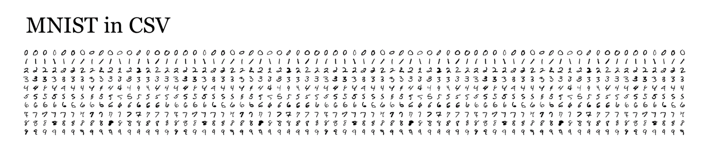
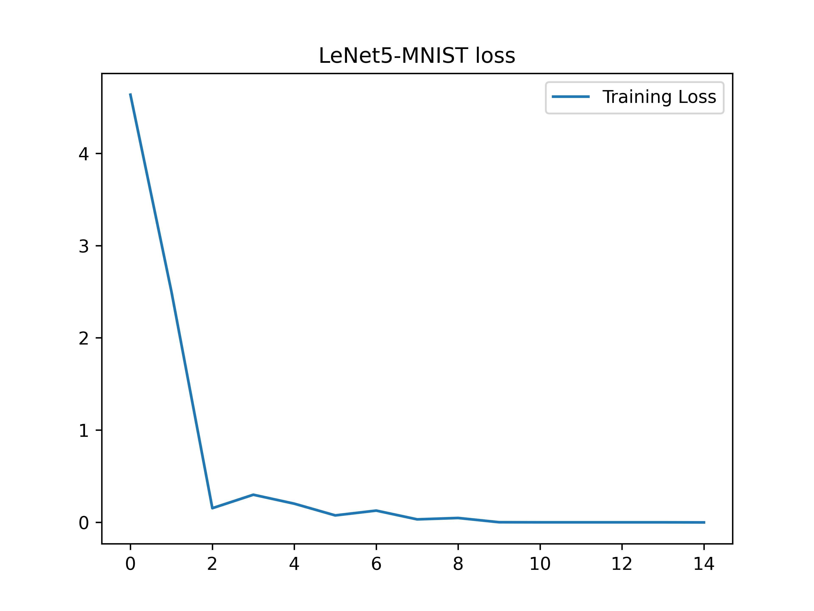

# LeNet5-MNIST

使用LeNet5网络模型在手写数字数据集MNIST上构建模型


## LeNet5简介

LeNet-5是由Yann LeCun等人在1998年提出的经典卷积神经网络架构，出自论文《Gradient-Based Learning Applied to Document Recognition》，是CNN网络的开山算法

其网络结构如下：

```
[Lumos]         Module Structure
Convolutional   Layer    :    [filters= 6, ksize= 5, stride= 1, pad= 0, bias=1, active=relu]
Max Pooling     Layer    :    [ksize= 2]
Convolutional   Layer    :    [filters=16, ksize= 5, stride= 1, pad= 0, bias=1, active=relu]
Max Pooling     Layer    :    [ksize= 2]
Convolutional   Layer    :    [filters=120, ksize= 5, stride= 1, pad= 0, bias=1, active=relu]
Im2col          Layer
Connect         Layer    :    [output=  84, bias=1, active=relu]
Connect         Layer    :    [output=  10, bias=1, active=relu]
Softmax         Layer    :    [output=  10]
Mse             Layer    :    [output=   1]
```


## MNIST数据集简介

MNIST（modified national institute of standard and technology）数据集是由Yann LeCun及其同事于1994年创建一个大型手写数字数据库（包含0~9十个数字）。MNIST数据集的原始数据来源于美国国家标准和技术研究院（national institute of standard and technology）的两个数据集：special database 1和special database 3。它们分别由NIST的员工和美国高中生手写的0-9的数字组成。原始的这两个数据集由128×128像素的黑白图像组成。LeCun等人将其进行归一化和尺寸调整后得到的是28×28的灰度图像


## 模型构建

### 数据集

数据集下载[MNIST](https://mypikpak.com/s/VOFC3G89YgSGmD2X2ZTt4v7Xo1)

本模型使用的数据集中，每一张图片的大小为32\*32\*1，分为训练集和测试集

训练集样本为1934张PNG图片，测试集样本为946张PNG图片

每一个训练数据或测试数据都具有如下类别标签：

- 0  zero
- 1  one
- 2  two
- 3  three
- 4  fore
- 5  five
- 6  six
- 7  seven
- 8  eight
- 9  nine

图片中每一个像素值都为正常像素值1~255




### 网络结构

```
[Lumos]         Module Structure
Convolutional   Layer    :    [filters= 6, ksize= 5, stride= 1, pad= 0, bias=1, active=relu]
Max Pooling     Layer    :    [ksize= 2]
Convolutional   Layer    :    [filters=16, ksize= 5, stride= 1, pad= 0, bias=1, active=relu]
Max Pooling     Layer    :    [ksize= 2]
Convolutional   Layer    :    [filters=120, ksize= 5, stride= 1, pad= 0, bias=1, active=relu]
Im2col          Layer
Connect         Layer    :    [output=  84, bias=1, active=relu]
Connect         Layer    :    [output=  10, bias=1, active=relu]
Softmax         Layer    :    [output=  10]
Mse             Layer    :    [output=   1]
```

损失函数采用Mse（均方差）
$$
MSE=\frac{1}{n}SSE=\frac{1}{n} \sum_{i=1}^{n}(\hat{y_{i}}-y_i)^{2} \\
\hat{y_{i}}预测结果，y_i 真实标签
$$


## 代码构建

### 网络构建

首先创建graph，并将所有layer添加至graph中

lumos接受数据必须是图片形式，所以当完成卷积计算进入全连接层后需要添加im2col层将图像数据转化为一维向量

```c
Graph *g = create_graph();
Layer *l1 = make_convolutional_layer(6, 5, 1, 0, 1, 0, "relu");
Layer *l2 = make_maxpool_layer(2, 2, 0);
Layer *l3 = make_convolutional_layer(16, 5, 1, 0, 1, 0, "relu");
Layer *l4 = make_maxpool_layer(2, 2, 0);
Layer *l5 = make_convolutional_layer(120, 5, 1, 0, 1, 0, "relu");
Layer *l6 = make_im2col_layer();
Layer *l7 = make_connect_layer(84, 1, "relu");
Layer *l8 = make_connect_layer(10, 1, "relu");
Layer *l9 = make_softmax_layer(10);
Layer *l10 = make_mse_layer(10);
append_layer2grpah(g, l1);
append_layer2grpah(g, l2);
append_layer2grpah(g, l3);
append_layer2grpah(g, l4);
append_layer2grpah(g, l5);
append_layer2grpah(g, l6);
append_layer2grpah(g, l7);
append_layer2grpah(g, l8);
append_layer2grpah(g, l9);
append_layer2grpah(g, l10);
```


### 权重初始化器

Lumos框架默认采用KaimingHe初始化


### 创建会话

创建会话，设置输入数据大小和标签数据规模，指定训练模式（CPU or GPU）和预训练权重

```c
Session *sess = create_session(g, 32, 32, 1, 10, type, path);
```


### 创建训练场景

指定训练数据，训练batch设置为4，训练15轮，学习率 0.01

设置训练数据目录列表和标签数据目录列表

```c
set_train_params(sess, 15, 4, 4, 0.01);
init_session(sess, "./data/mnist/train.txt", "./data/mnist/train_label.txt");
```


### 创建测试会话和场景

```c
Session *sess = create_session(g, 32, 32, 1, 10, type, path);
set_detect_params(sess);
init_session(sess, "./data/mnist/test.txt", "./data/mnist/test_label.txt");
detect_classification(sess);
```


### 完整代码

```c
void lenet5_mnist(char *type, char *path)
{
    Graph *g = create_graph();
    Layer *l1 = make_convolutional_layer(6, 5, 1, 0, 1, 0, "relu");
    Layer *l2 = make_maxpool_layer(2, 2, 0);
    Layer *l3 = make_convolutional_layer(16, 5, 1, 0, 1, 0, "relu");
    Layer *l4 = make_maxpool_layer(2, 2, 0);
    Layer *l5 = make_convolutional_layer(120, 5, 1, 0, 1, 0, "relu");
    Layer *l6 = make_im2col_layer();
    Layer *l7 = make_connect_layer(84, 1, "relu");
    Layer *l8 = make_connect_layer(10, 1, "relu");
    Layer *l9 = make_softmax_layer(10);
    Layer *l10 = make_mse_layer(10);
    append_layer2grpah(g, l1);
    append_layer2grpah(g, l2);
    append_layer2grpah(g, l3);
    append_layer2grpah(g, l4);
    append_layer2grpah(g, l5);
    append_layer2grpah(g, l6);
    append_layer2grpah(g, l7);
    append_layer2grpah(g, l8);
    append_layer2grpah(g, l9);
    append_layer2grpah(g, l10);
    Session *sess = create_session(g, 32, 32, 1, 10, type, path);
    set_train_params(sess, 15, 4, 4, 0.01);
    init_session(sess, "./data/mnist/train.txt", "./data/mnist/train_label.txt");
    train(sess);
}

void lenet5_mnist_detect(char*type, char *path)
{
    Graph *g = create_graph();
    Layer *l1 = make_convolutional_layer(6, 5, 1, 0, 1, 0, "relu");
    Layer *l2 = make_maxpool_layer(2, 2, 0);
    Layer *l3 = make_convolutional_layer(16, 5, 1, 0, 1, 0, "relu");
    Layer *l4 = make_maxpool_layer(2, 2, 0);
    Layer *l5 = make_convolutional_layer(120, 5, 1, 0, 1, 0, "relu");
    Layer *l6 = make_im2col_layer();
    Layer *l7 = make_connect_layer(84, 1, "relu");
    Layer *l8 = make_connect_layer(10, 1, "relu");
    Layer *l9 = make_softmax_layer(10);
    Layer *l10 = make_mse_layer(10);
    append_layer2grpah(g, l1);
    append_layer2grpah(g, l2);
    append_layer2grpah(g, l3);
    append_layer2grpah(g, l4);
    append_layer2grpah(g, l5);
    append_layer2grpah(g, l6);
    append_layer2grpah(g, l7);
    append_layer2grpah(g, l8);
    append_layer2grpah(g, l9);
    append_layer2grpah(g, l10);
    Session *sess = create_session(g, 32, 32, 1, 10, type, path);
    set_detect_params(sess);
    init_session(sess, "./data/mnist/test.txt", "./data/mnist/test_label.txt");
    detect_classification(sess);
}
```


## 训练及结果

使用如下命令编译代码

```shell
gcc -fopenmp lenet5_mnist.c -I/usr/local/lumos/include/ -o main -L/usr/local/lumos/lib -llumos
```

编译完成后运行

可以看到，打印出的网络结构

```
[Lumos]         Module Structure
Convolutional   Layer    :    [filters= 6, ksize= 5, stride= 1, pad= 0, bias=1, active=relu]
Max Pooling     Layer    :    [ksize= 2]
Convolutional   Layer    :    [filters=16, ksize= 5, stride= 1, pad= 0, bias=1, active=relu]
Max Pooling     Layer    :    [ksize= 2]
Convolutional   Layer    :    [filters=120, ksize= 5, stride= 1, pad= 0, bias=1, active=relu]
Im2col          Layer
Connect         Layer    :    [output=  84, bias=1, active=relu]
Connect         Layer    :    [output=  10, bias=1, active=relu]
Softmax         Layer    :    [output=  10]
Mse             Layer    :    [output=   1]


[Lumos]                     Inputs         Outputs
Convolutional   Layer     32* 32*  1 ==>  28* 28*  6
Max Pooling     Layer     28* 28*  6 ==>  14* 14*  6
Convolutional   Layer     14* 14*  6 ==>  10* 10* 16
Max Pooling     Layer     10* 10* 16 ==>   5*  5* 16
Convolutional   Layer      5*  5* 16 ==>   1*  1*120
Im2col          Layer      1*  1*120 ==>   1*  1*120
Connect         Layer      1*  1*120 ==>   1*  1* 84
Connect         Layer      1*  1* 84 ==>   1*  1* 10
Softmax         Layer      1*  1* 10 ==>   1*  1* 10
Mse             Layer      1*  1* 10 ==>   1*  1*  1
```

最终得到如下结果

```
./data/mnist/test/9_9.png
Truth     Detect
0.000 0.000
0.000 0.001
0.000 0.003
0.000 0.000
0.000 0.002
0.000 0.033
0.000 0.000
0.000 0.002
0.000 0.020
1.000 0.938
Loss:0.0005

Detct Classification: 910/946  0.96
```




在测试数据集上表现良好，获得96%的正确率